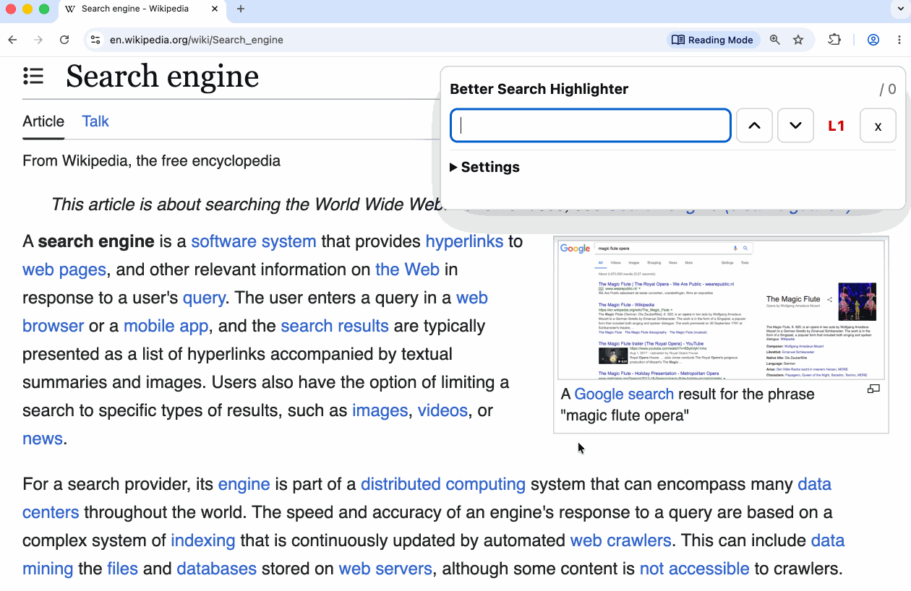

# Better Search Highlighter

<div align="center">
<p>
Better Search Highlighter is a Chrome extension that provides page search with multi-level highlighting for matched text.
</p>
</div>

<p align="center">
  
</p>

<p align="center">
  <a href="README_ja.md">Japanese README</a>
</p>

<p align="center">
  <a href="docs/store-listing/en.md"></a>
  <a href="LICENSE"></a>
</p>

## Overview

- Search text on the current page, similar to the browser's built-in page search.
- Change the highlight level with `ArrowUp` and `ArrowDown`.
  - Level 1: yellow highlight similar to standard page search
  - Level 2: red highlight
  - Level 3: blinking red highlight, only when blinking is allowed
  - Level 4: dim the page and spotlight the current match
- Blinking can be disabled for users who prefer not to use it.
  - `prefers-reduced-motion` is also respected.
- All processing runs locally.
- To avoid performance impact on dynamically generated or very large pages, the extension limits how much text it loads. Enable the "Search all content" option when you want to search all content.
  - ⚠️ Because this searches the page without limits, it may affect performance on some pages.

## Usage

Open the search panel from:

- Extension action button
- Right-click context menu
- Keyboard shortcut

Default shortcut:

- Windows / Linux: `Alt+Shift+F`
- macOS: `Option+Shift+F`

Inside the panel:

- Up arrow button / `Shift+Enter`: previous match
- Down arrow button / `Enter`: next match
- Match number field: type a number such as `40` and press `Enter`
- `ArrowUp`: increase highlight level
- `ArrowDown`: decrease highlight level
- `Escape`: close

## Settings

Settings can be changed from `Settings` in the search panel.

- Enable / disable blinking
- Enable / disable `Search all content`
- Reset the highlight level
- Reset the panel position
- Open Chrome shortcut settings
- Reset all settings

## Development

```sh
npm run check
npm run dev:chrome
```
